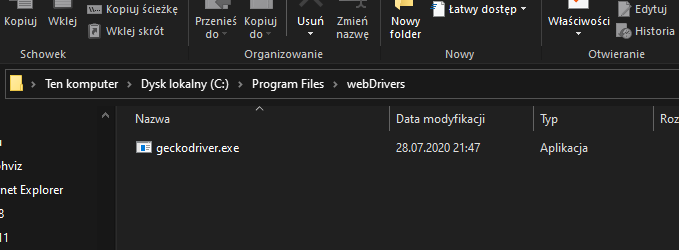
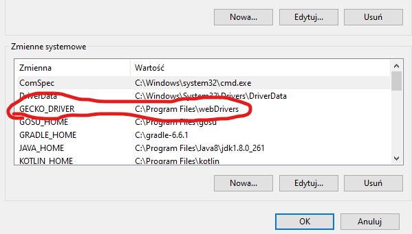

# SeleniumBot

### Instrukcja dodawania sterownika przeglądarki jako zmiennej systemowej

Plick geckodriver.exe zapisz na dysku
(np. w  foldedze C:/Program Files/webDrivers)

Dodaj zmienną systemową GECKO_DRIVER i podaj ścieżkę do powyższego pliku

Dodaj zmienną GECKO_DRIVER do zmiennej PATH

